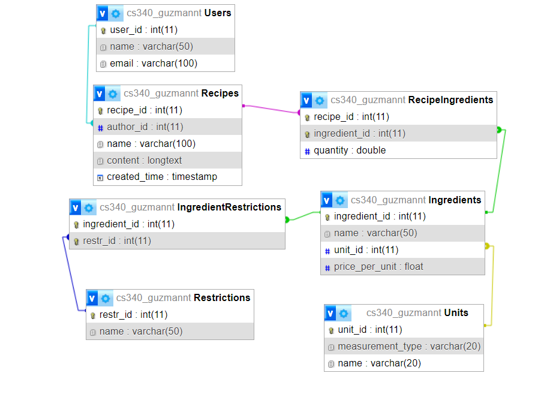

<h1>Project Overview</h1>

Navigating the complexities of budgeting as a college student has always been a challenge. LivingCost reports that Corvallis, Oregon has an average cost of living of $1983[1]. However, three of the most crucial groceries for college students, namely eggs (12 for $3.74), rice (1 kg or 2.2 lb for $3.51), and chicken breast (1 kg or 2.2 lb for $11.1), are among the priciest items. Consequently, they often resort to austerity foods such as instant mac and cheese, ramen, oatmeal, etc. Our mission is to empower students with exciting meal options that promote both financial savviness and culinary satisfaction, enabling them to cut down expenses without compromising on their taste buds or health.

No longer do students need to rely on bland, inexpensive meals. No More Ramen is a web platform for crowd-sourcing budget-conscious and delicious recipes aimed at students in Corvallis (designed to serve ~35000 members of the OSU student body). Students will be able to share and find recipes within their budget, calculated based on the approximate price of ingredients. The website will utilize a database backend to record recipes, their authors, the ingredients used in the recipes, their costs, as well as special dietary restrictions. The cost calculation was designed with a manually curated reference table (2023 sources) in mind.

<h2>Data Explanation</h2>
<a href="https://github.com/TeresitaCGNader/No_More_Ramen/blob/main/Data_Explanation.pdf" title="PDF">PDF</a>

